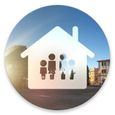

	
	<h1 align=center style="margin: 0;"> Home Assistant</h1>
	
Configuration

---

### Status of: 2020.05.31
Partial Home Assistant configuration with themes, templates and views.

### System Architecture

This Home Automation setup is currently running on a [Intel NUC 8I3BEH][intelnuc]. 
The specs are:
- CPU: Intel Core i3-8109U
- RAM: 16GB DDR4 SODIMM
- SSD: Samsung PM961 MZVLW512HMJP - 512GB
- HDD: Western Digital WD10SPZX-08Z - 1TB

This machine runs the latest version of **Ubuntu Server LTS.**

### Software
As already stated the OS of this little machine is **Ubuntu Server LTS.** 
On top of that there's **Docker**.
#### Docker Containers
- **Home Assistant**
*(homeassistant/qemux86-64-homeassistant)*
- **Mosquitto** 
*(homeassistant/amd64-addon-mosquitto)*
- **deCONZ** 
*(homeassistant/amd64-addon-deconz)*
- **MariaDB** 
*(homeassistant/amd64-addon-mariadb)*
- **ESPhome** 
*(esphome/esphome-hassio-amd64)*
- **Grafana** 
*(hassioaddons/grafana-amd64)*
- **InfluxDB** 
*(hassioaddons/influxdb-amd64)*
- **NginxProxyManager** 
*(hassioaddons/nginxproxymanager-amd64)*
- **NodeRED** 
*(hassioaddons/node-red-amd64)*
- **Portainer** 
*(hassioaddons/portainer-amd64)*
- **UniFi** 
*(hassioaddons/unifi-amd64)*
- **UniFi Video** 
*(pducharme/unifi-video-controller)*
- **DSMR** 
*(ualex73/dsmr-reader-docker)*
- **S0PCM** 
*(ualex73/s0pcm-reader)*

**And I use the following hardware in my house:**
- Phoscon [Conbee II stick][phoscon_conbee]
- Aeotec [Z-Stick Gen5][aeotec_zstick]
- Philips Hue [Bridge][hue_bridge]
- Philips Hue [E27 White Ambiance][hue_e27_white_ambiance]
- Philips Hue [E14 White and Color Ambiance][hue_e14_white_color_ambiance]
- Philips Hue [Dimmer switch][hue_dimmer_switch]
- iCasa [Pulse 4S][icasa_pulse]
- Ikea [Trådfri Remote control 5 button][ikea_remote]
- Ikea [Trådfri Wireless Dimmer][ikea_dimmer]
- Ikea [Trådfri Wireless motion sensor][ikea_motion]
- Ikea [Trådfri E14 LED 400lm][ikea_e14_400lm]
- Ikea [Trådfri E27 LED 806lm][ikea_e27_806lm]
- Ikea [Trådfri E27 LED 1000lm][ikea_e27_1000lm]
- Ikea [Trådfri E27 LED Filament 250lm][ikea_e27_250lm]
- Ikea [Trådfri Driver 10W][ikea_driver_10w]
- Ikea [Trådfri Driver 30W][ikea_driver_30w]
- Innr [Smart Plug SP120][innr_sp120]
- Fibaro [Dimmer 2][fibaro_dimmer2]
- Fibaro [Double Switch 2][fibaro_switch2]
- Fibaro [Wall Plug][fibaro_wallplug]
- Fibaro [Smoke Sensor][fibaro_smoke]
- Fibaro [Universal Binary Sensor][fibaro_binsensor]
- Fibaro [Keyfob][fibaro_keyfob]
- Xiaomi [Temperature & Humidity Sensors][xiaomi_temp]
- Xiaomi [Window Door Sensors][xiaomi_door]
- Xiaomi [Motion Sensors][xiaomi_motion]
- BlitzWolf [BW-SHP2][bw-shp2]
- BlitzWolf [BW-SHP6][bw-shp6]
- LSC [Smart Connect RGBW ledstrip][lsc_rgbw_ledstrip]
- MagicHome [LED-controller][magichome_rgbw_led]
- Xiaomi [MiFlora][miflora]
- Tado [Smart Thermostat v3][tado_smart_thermostat]
- Roborock [S55][roborock_s55]
- Ubiquiti [G3 Camera][ubnt_g3]
- Google [Next Hub][google_hub]

### How does it look like?
The below screenshots show some mobile examples. 
**Light theme:** 
 
 

**Dark theme:** 
 
 

### Inspired by
- https://github.com/dwainscheeren/lovelace-dwains-theme
- https://github.com/jimz011/homeassistant
- https://github.com/AmoebeLabs/Home-Assistant-Config

---

[homeassistantconfig]: https://github.com/Klumpke/homeassistant-config
[issues]: https://github.com/Klumpke/homeassistant-config/issues
[paypal]: https://www.paypal.me/JeroenKlompen

[home-assistant]: https://home-assistant.io
[hassio]: https://www.home-assistant.io/hassio/

[intelnuc]: https://www.intel.com/content/www/us/en/products/boards-kits/nuc/kits/nuc8I3BEH.html

[phoscon_conbee]: https://www.phoscon.de/en/conbee2
[aeotec_zstick]: https://aeotec.com/z-wave-usb-stick/
[hue_bridge]: https://www2.meethue.com/nl-nl/p/hue-bridge/8718696511800
[hue_e27_white_ambiance]: https://www2.meethue.com/nl-nl/p/hue-white-ambiance-2-pack-e27/8718699673369
[hue_e14_white_color_ambiance]: https://www2.meethue.com/nl-nl/p/hue-white-and-color-ambiance-losse-kaarslamp-e14/8718696695166
[hue_dimmer_switch]: https://www2.meethue.com/nl-nl/p/hue-dimmer-switch/8718696743157
[icasa_pulse]: https://www.icasa.io/wandschakelaars
[ikea_remote]: https://www.ikea.com/nl/nl/p/tradfri-afstandsbediening-30443124/
[ikea_dimmer]: https://www.ikea.com/nl/nl/p/tradfri-draadloze-dimmer-wit-70408595/
[ikea_motion]: https://www.ikea.com/nl/nl/p/tradfri-draadloze-bewegingssensor-wit-70429913/
[ikea_e14_400lm]: https://www.ikea.com/nl/nl/p/tradfri-led-lamp-e14-400-lumen-draadloos-dimbaar-warm-wit-kaarslamp-opaalwit-60365271/
[ikea_e27_806lm]: https://www.ikea.com/nl/nl/p/tradfri-set-met-dimmer-10435926/
[ikea_e27_1000lm]: http://www.ikea.com/nl/nl/catalog/products/80349888/
[ikea_e27_250lm]: https://www.ikea.com/nl/nl/p/tradfri-led-lamp-e27-250-lumen-draadloos-dimbaar-warm-schijnsel-globe-bruin-helder-glas-70455676/
[ikea_driver_10w]: https://www.ikea.com/nl/nl/p/tradfri-driver-voor-draadloze-besturing-grijs-50356187/
[ikea_driver_30w]: https://www.ikea.com/nl/nl/p/tradfri-driver-voor-draadloze-besturing-grijs-60342656/
[innr_sp120]: https://shop.innrlighting.com/nl/shop/134/smart-plug-
[fibaro_dimmer2]: https://www.fibaro.com/en/products/dimmer-2/
[fibaro_switch2]: https://www.fibaro.com/en/products/switches/
[fibaro_wallplug]: https://www.fibaro.com/en/products/wall-plug/
[fibaro_smoke]: https://www.fibaro.com/en/products/smoke-sensor/
[fibaro_binsensor]: https://www.fibaro.com/en/products/universal-binary-sensor/
[fibaro_keyfob]: https://www.fibaro.com/en/products/keyfob/
[xiaomi_temp]: https://www.banggood.com/Original-Xiaomi-Aqara-Atmos-Version-Temperature-Humidity-Sensor-Smart-Home-Thermometer-Hygrometer-p-1148666.html?rmmds=myorder&cur_warehouse=GWTR
[xiaomi_door]: https://www.banggood.com/Original-Xiaomi-Aqara-Zig_Bee-Version-Window-Door-Sensor-Smart-Home-Kit-Remote-Alarm-p-1149705.html?rmmds=myorder&cur_warehouse=GWTR
[xiaomi_motion]: https://www.banggood.com/Original-Aqara-Zig_Bee-Wireless-Human-Body-PIR-Sensor-Smart-Home-Kit-From-Xiaomi-Eco-System-p-1177007.html?rmmds=myorder&cur_warehouse=CN
[bw-shp2]: https://www.banggood.com/BlitzWolf-BW-SHP2-16A-Smart-WIFI-Socket-220V-EU-Plug-Work-with-Amazon-Alexa-Google-Assistant-Compatible-with-BlitzWolf-Tuya-APP-p-1292899.html?rmmds=search&ID=47184&cur_warehouse=CN
[bw-shp6]: https://www.banggood.com/BlitzWolf-BW-SHP6-EU-Plug-Metering-Version-WIFI-Smart-Socket-220V-240V-10A-Work-with-Amazon-Alexa-p-1356981.html?rmmds=search&cur_warehouse=CN
[lsc_rgbw_ledstrip]: https://www.action.com/nl-nl/p/lsc-smart-connect-slimme-multicolor-ledstrip-/
[magichome_rgbw_led]: https://nl.aliexpress.com/item/32865919702.html?spm=a2g0s.9042311.0.0.7cb14c4dYuSrC3
[miflora]: https://nl.aliexpress.com/item/4000131669924.html?spm=a2g0o.productlist.0.0.34781762uvPDL1&algo_pvid=0336ca00-a1b2-47a1-9443-6d3c943b7fbf&algo_expid=0336ca00-a1b2-47a1-9443-6d3c943b7fbf-0&btsid=ca12ffb4-4507-4ee6-8af1-ece8150436a3&ws_ab_test=searchweb0_0,searchweb201602_,searchweb201603_55
[tado_smart_thermostat]: https://www.tado.com/nl/producten/starterskit-slimme-thermostaat
[roborock_s55]: https://nl.aliexpress.com/item/32852322829.html?spm=a2g0s.9042311.0.0.563e4c4dl4qQt1
[ubnt_g3]: https://www.ui.com/unifi-video/unifi-video-camera-g3/
[google_hub]: https://store.google.com/nl/product/google_nest_hub

[xiaomi_curtains_track]: https://nl.aliexpress.com/item/3-5-M-Xiaomi-Super-Stille-Elektrische-Gordijn-Track-voor-Mijia-Aqara-Motor-Automatische-Gordijn-Rails/32922713008.html?spm=a2g0s.9042311.0.0.1cf94c4d06j07R
[xiaomi_curtains_motor]: https://nl.aliexpress.com/item/Xiaomi-Aqara-Smart-Gordijn-Motor-Intelligente-Zigbee-Wifi-Voor-xiaomi-Smart-Home-Apparaat-Draadloze-Afstandsbediening-Via/32872671734.html?spm=a2g0s.9042311.0.0.1cf94c4d06j07R
[BW-LT11]: https://www.banggood.com/BlitzWolf-BW-LT11-2M5M-Smart-APP-Control-RGBW-LED-Light-Strip-Kit-Work-With-Amazon-Alexa-Google-Assistant-p-1390470.html?rmmds=search

[tv]: https://student-techlife.com/2019/06/02/my-tv-is-out-of-own-control/
[household]: https://student-techlife.com/2019/07/09/what-task-do-we-do-today/